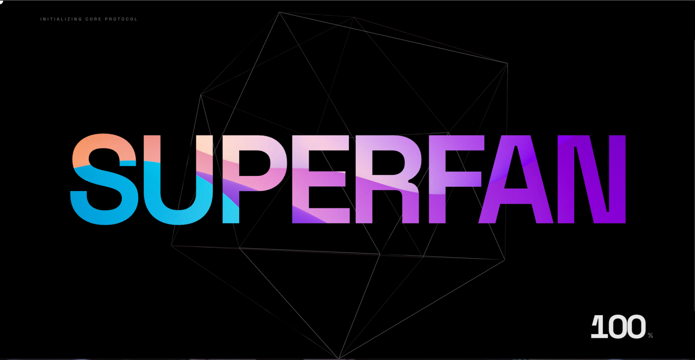
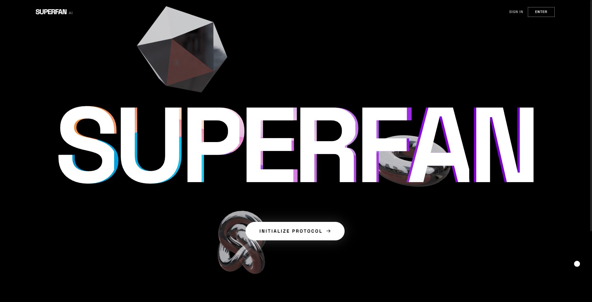
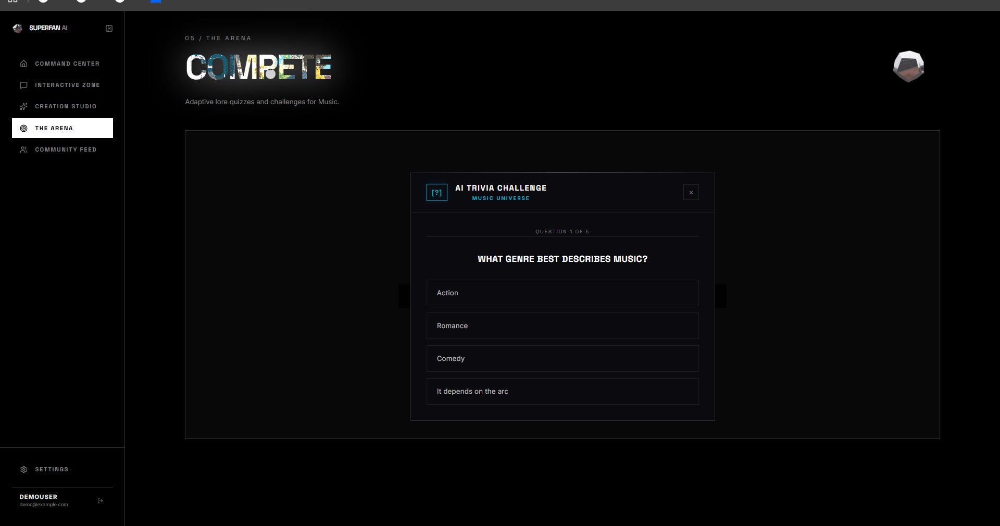
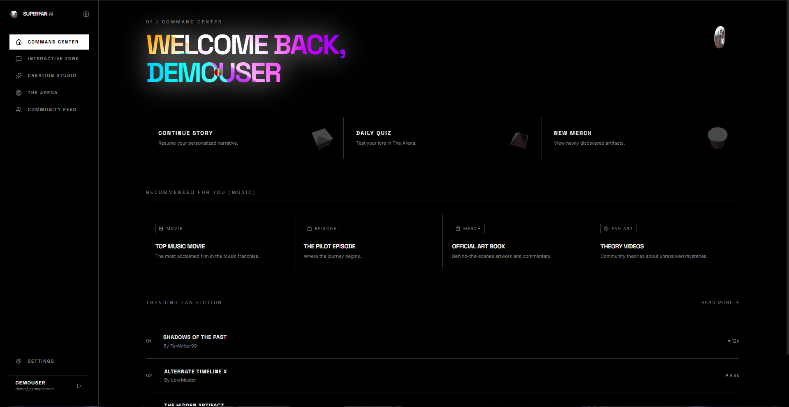
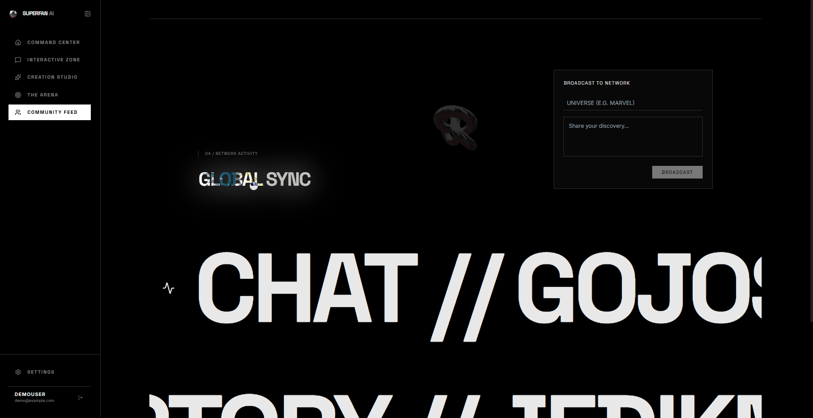

# SuperFan AI

SuperFan AI is an immersive, multi-agent platform designed to provide dynamic, AI-driven interactive experiences tailored to individual fandoms. By orchestrating a system of specialized AI agents, it dynamically generates lore quizzes, personalized fan fiction, community recommendations, and interactive character chats based on a user's unique neural fan profile.

## Overview

The application is built with a heavy emphasis on cinematic, high-performance web design. It features liquid foil typographic effects, interactive 3D geometries, and deeply integrated scroll animations to create a premium user experience. The backend relies on a dynamic LLM routing system that intelligently load-balances across a pool of API keys to ensure uninterrupted generation during heavy load.

## Core Features

- **Dynamic Command Center**: A personalized dashboard that tracks your Fan Memory Core, displaying your active universe synchronizations, XP levels, and AI journey analysis.
- **Adaptive Arena**: An intelligent quiz engine that utilizes a Quiz Agent to dynamically generate lore questions at varying difficulties based on your preferred universe and existing fan knowledge.
- **Creation Studio**: A creative suite where the Content Agent generates completely unique, personalized fan fiction, alternate timelines, and narrative expansions in real-time.
- **Interactive Zone**: A chat interface powered by specialized Character Agents, allowing you to converse seamlessly with entities from your favorite universes.
- **Multi-Agent Orchestration**: The backend seamlessly coordinates between the Memory Agent (context tracking), Quiz Agent (gamification), Recommendation Agent (content discovery), and Content Agent (narrative generation).

## Technology Stack

### Frontend
- **Framework**: React 19 + Vite
- **Styling**: Tailwind CSS
- **Animation Engine**: GSAP (GreenSock Animation Platform) + Lenis (Smooth Scroll)
- **3D Graphics**: Three.js + React Three Fiber + Drei
- **Icons**: Lucide React

### Backend
- **Framework**: FastAPI (Python)
- **AI Orchestration**: LiteLLM for dynamic model routing and fallback handling
- **Primary LLM**: Google Gemini 1.5 Flash
- **Architecture**: Specialized modular Agent system

## Setup Instructions

### Prerequisites
- Node.js (v18 or higher)
- Python (3.10 or higher)
- Google Gemini API Keys

### Backend Installation
1. Navigate to the backend directory: `cd backend`
2. Create a virtual environment: `python -m venv venv`
3. Activate the virtual environment:
   - Windows: `.\venv\Scripts\Activate.ps1`
   - Mac/Linux: `source venv/bin/activate`
4. Install dependencies: `pip install -r requirements.txt`
5. Configure environment variables: Add your Gemini API keys to the `.env` file for the load balancer.
6. Start the server: `uvicorn app.main:app --reload`

### Frontend Installation
1. Navigate to the frontend directory: `cd frontend`
2. Install dependencies: `npm install`
3. Start the development server: `npm run dev`

## Previews

You can find high-resolution screenshots of the interface below:

### The Cinematic Landing Experience

### Personalized User Dashboard

### Adaptive Trivia Engine

### Character Chat Interface

### AI Generation Suite

